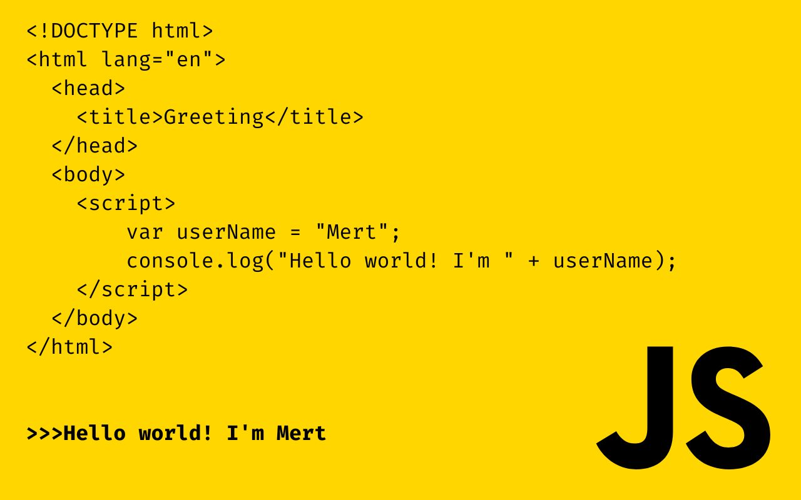

</a>
<h3 align="center">I am Front-end Developer </h3>
 
<h3 align="center">I’m currently learning <b>React </h3>
<h3 align="center">How to reach me <b>mmertartar@gmail.com </h3>
 
<h3 align="center">Connect with me:</h3>

 
<h3 align="center">Languages and Tools:</h3>

 

   
  

 
 

&nbsp;

